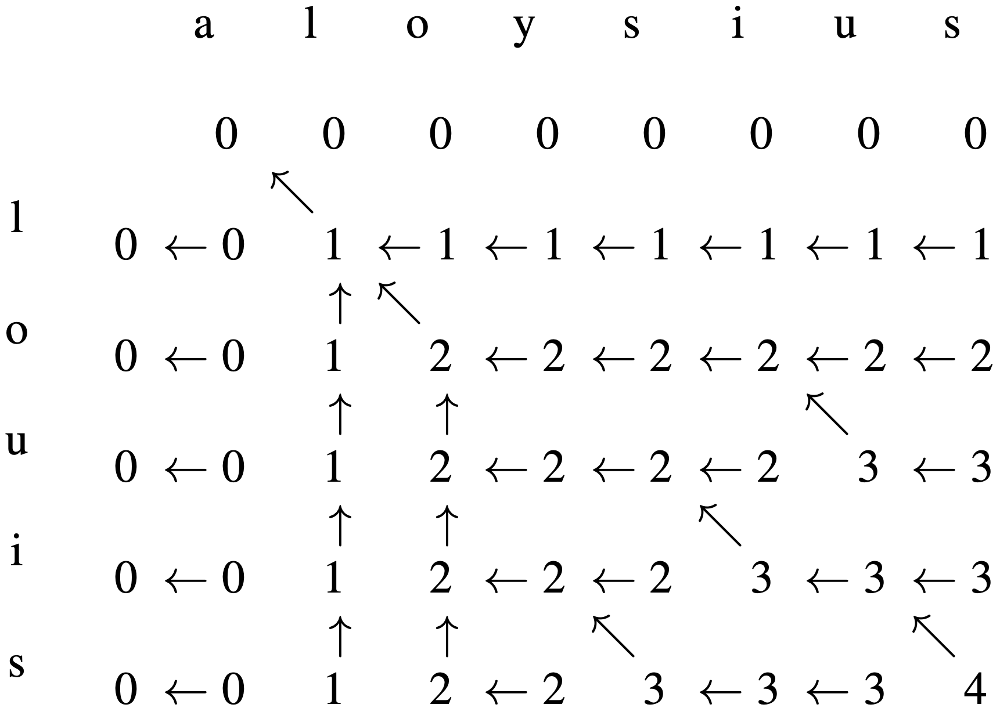

More information about the Longest Common Subsequence dynamic programming algorithm can be found on [Wikipedia](https://en.wikipedia.org/wiki/Longest_common_subsequence_problem). Visual aid of the example in the code is provided below:

